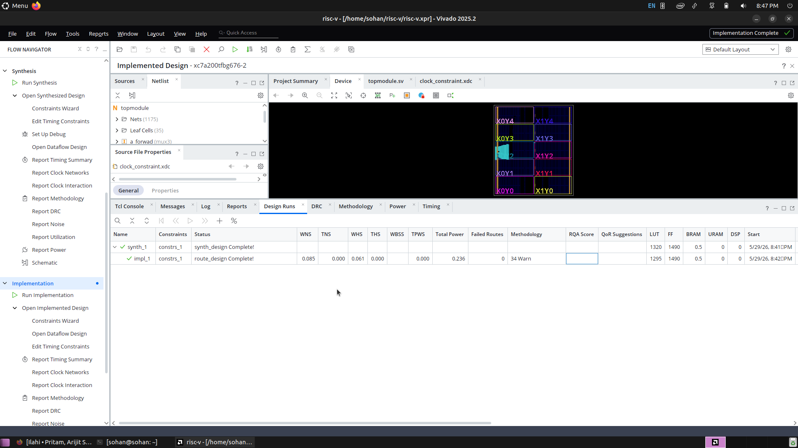
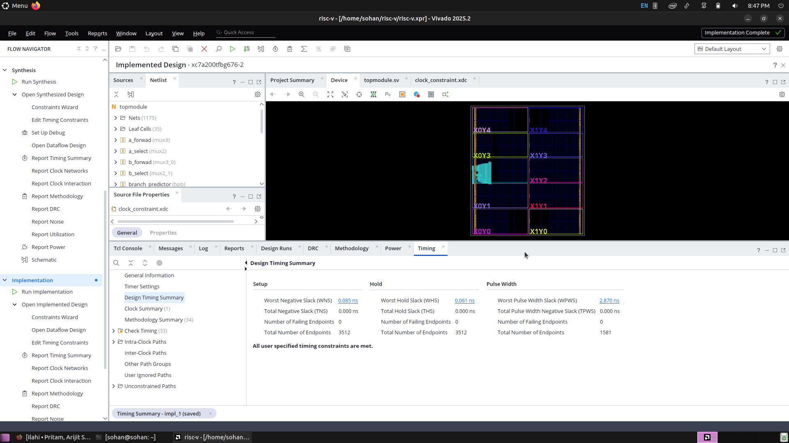
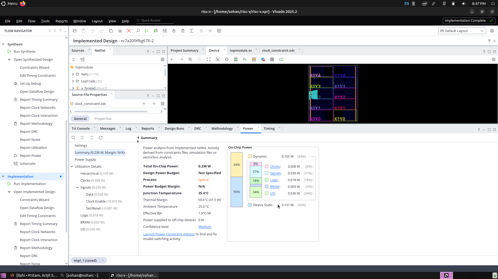

# 5-Stage Pipelined RV32I RISC-V Processor with Dynamic Branch Prediction

A fully functional 32-bit 5-stage pipelined RISC-V processor designed and implemented in Verilog HDL.  
The processor supports pipelined execution, hazard handling, dynamic branch prediction, speculative fetch, and memory operations following the RV32I ISA specification.


---

# Features

## 5-Stage Pipeline Architecture

- Instruction Fetch (IF)
- Instruction Decode (ID)
- Execute (EX)
- Memory Access (MEM)
- Write Back (WB)

---

# RV32I Instruction Support

## Arithmetic Instructions

```assembly
add
sub
addi
slt
sltu
```

## Logical Instructions

```assembly
and
or
xor
sll
srl
sra
```

## Memory Instructions

```assembly
lw
sw
```

## Control Flow Instructions

```assembly
beq
bne
blt
bge
jal
jalr
```

---

# Hazard Handling

## Data Hazard Resolution

Implemented using:
- EX/MEM Forwarding
- MEM/WB Forwarding
- Store Data Forwarding

## Load-Use Hazard Detection

Implemented using:
- Pipeline Stalling
- PC Freeze
- IF/ID Freeze
- Bubble Injection into ID/EX

## Control Hazard Handling

Implemented using:
- Pipeline Flush Logic
- Branch Recovery Mechanism
- Speculative Fetch Cancellation

---

# Dynamic Branch Prediction

The processor implements dynamic branch prediction to reduce branch penalties and improve pipeline performance.

## Branch Prediction Components

### Branch Prediction Buffer (BPB)

- 16-entry 2-bit saturating branch predictor
- Dynamically learns branch behavior
- Uses per-branch prediction states

### Branch Target Buffer (BTB)

- 16-entry Branch Target Buffer
- Stores predicted target addresses
- Includes valid bits and tag matching
- Prevents false target predictions caused by aliasing

### Speculative Fetch

- Predicted target instructions are fetched before branch resolution
- Incorrect predictions trigger pipeline flush and recovery

---

# Pipeline Registers

- IF/ID Register
- ID/EX Register
- EX/MEM Register
- MEM/WB Register

---

# Additional Modules

- Control Unit
- ALU Decoder
- Immediate Generator
- Register File
- Instruction Memory
- Data Memory
- Hazard Detection Unit
- Forwarding Unit
- Branch Comparator
- Branch Prediction Buffer (BPB)
- Branch Target Buffer (BTB)

---

# Pipeline Architecture

```text
IF -> ID -> EX -> MEM -> WB
```

The processor implements a classic pipelined datapath with hazard mitigation and speculative control flow execution.

---

# Branch Prediction Architecture

```text
PC
 │
 ▼
BTB + BPB
 │
 ▼
Predicted Next PC
 │
 ▼
Pipeline Fetch
 │
 ▼
Branch Resolution in EX Stage
 │
 ├── Correct Prediction  -> Continue
 └── Misprediction       -> Flush + Redirect PC
```

---

# Example Instructions

```assembly
addi x1, x0, 5
addi x2, x0, 10
add  x3, x1, x2
sub  x4, x2, x1

lw   x5, 0(x0)
sw   x5, 4(x0)

beq  x1, x2, label
bne  x3, x4, loop

jal  x0, target
jalr x0, x1, 0
```

---

# Verification and Testing

The processor was verified using custom Verilog testbenches covering:

- Arithmetic operations
- Memory operations
- Data hazards
- Forwarding paths
- Load-use stalls
- Branch hazards
- Branch prediction training
- BTB hit/miss behavior
- Pipeline flush recovery
- Nested and loop branches

---

## FPGA Validation

The processor was synthesized and implemented on a Xilinx Artix-7 XC7A200T FPGA. Timing closure was achieved at 125 MHz with positive setup and hold slack.

# FPGA Implementation Results

Target Device:
- Xilinx Artix-7 XC7A200T

## Timing Performance

| Metric | Value |
|----------|----------|
| Target Frequency | 125 MHz |
| Achieved Fmax | ~126 MHz |
| Worst Negative Slack (WNS) | +0.085 ns |
| Total Negative Slack (TNS) | 0 ns |
| Timing Closure | Passed |

## Resource Utilization

| Resource | Utilization |
|----------|------------|
| LUTs | 1295 |
| Flip-Flops | 1490 |
| BRAM | 0.5 |
| DSP | 0 |

## Power Consumption

| Metric | Value |
|----------|----------|
| Total On-Chip Power | 0.236 W |
| Dynamic Power | 0.105 W |
| Static Power | 0.131 W |

# FPGA Reports

## Device Utilization



## Timing Report



## Power Report



# Project Status

Completed implementation of a fully hazard-aware 5-stage pipelined RV32I processor featuring:

- Forwarding
- Stalling
- Pipeline Flushing
- Dynamic Branch Prediction
- BTB-based Target Prediction
- 2-bit Saturating BPB
- Speculative Fetch and Recovery
