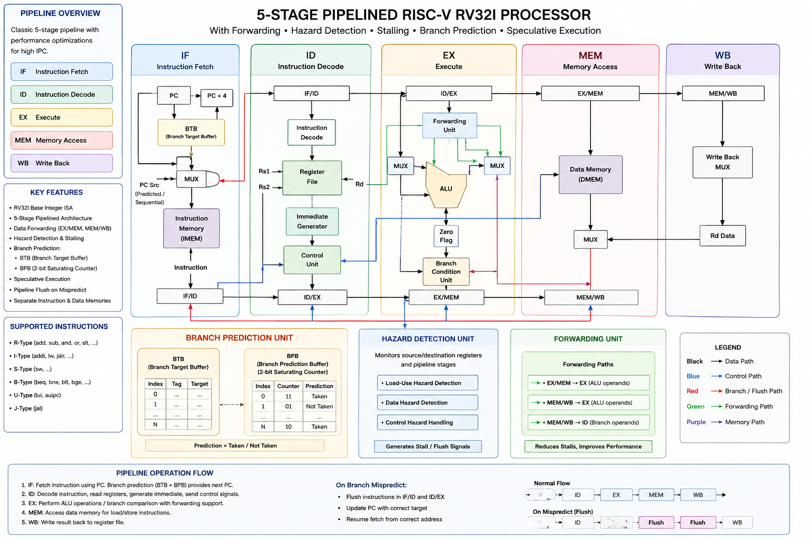
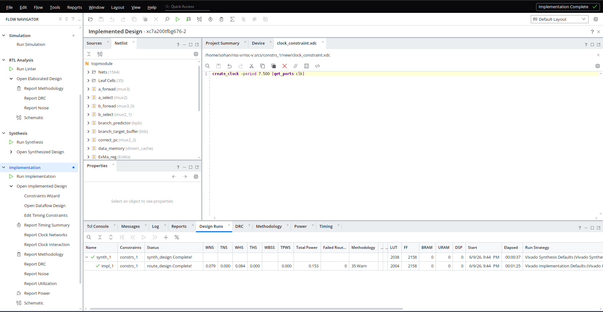
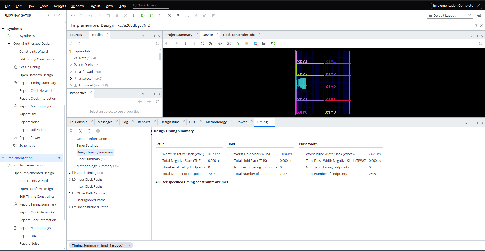
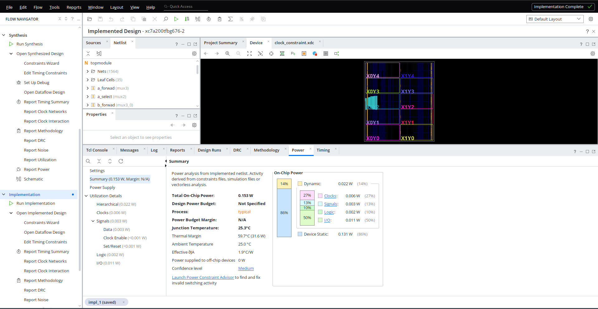

# RV32I 5-Stage Pipelined RISC-V Processor

A fully synthesizable 32-bit RV32I RISC-V processor implemented in Verilog HDL featuring a classic 5-stage pipeline, dynamic branch prediction, instruction and data caches, hazard resolution, and FPGA deployment on a Xilinx Artix-7 device.



---

# Overview

This project implements a complete RV32I processor with:

- 5-stage pipelined datapath
- Dynamic branch prediction
- Branch Target Buffer (BTB)
- Instruction cache
- Data cache
- Data forwarding network
- Hazard detection and recovery
- FPGA timing closure and hardware validation

The processor supports speculative execution through branch prediction and includes mechanisms for handling data, control, and memory hazards.

---

# RV32I ISA Support

The processor implements the complete RV32I Base Integer Instruction Set Architecture.

## Supported Instructions

### Arithmetic
```assembly
add
sub
addi
```

### Logical
```assembly
and
or
xor
andi
ori
xori
```

### Shift
```assembly
sll
srl
sra
slli
srli
srai
```

### Comparison
```assembly
slt
sltu
slti
sltiu
```

### Load Instructions
```assembly
lb
lh
lw
lbu
lhu
```

### Store Instructions
```assembly
sb
sh
sw
```

### Branch Instructions
```assembly
beq
bne
blt
bge
bltu
bgeu
```

### Jump Instructions
```assembly
jal
jalr
```

### Upper Immediate Instructions
```assembly
lui
auipc
```

---

# Hazard Resolution

## Data Hazards

Implemented through:

- EX/MEM forwarding
- MEM/WB forwarding
- Store-data forwarding

## Load-Use Hazards

Handled using:

- Pipeline stalling
- PC freeze
- IF/ID freeze
- Bubble insertion

## Control Hazards

Handled through:

- Dynamic branch prediction
- Branch target prediction
- Pipeline flushing
- Speculative execution recovery

---

# Dynamic Branch Prediction

The processor uses a two-level branch prediction system.

## Branch Prediction Buffer (BPB)

- 16-entry predictor table
- 2-bit saturating counters
- Dynamic predictor training
- Per-branch prediction history

State machine:

```text
00 Strongly Not Taken
01 Weakly Not Taken
10 Weakly Taken
11 Strongly Taken
```

## Branch Target Buffer (BTB)

- 16-entry BTB
- Valid bits
- Tag matching
- Predicted target addresses

## Speculative Fetch

```text
PC
 │
 ▼
BTB + BPB
 │
 ▼
Predicted PC
 │
 ▼
Instruction Fetch
 │
 ▼
Branch Resolution
 │
 ├── Correct Prediction
 │      └── Continue Execution
 │
 └── Misprediction
        └── Flush + Redirect
```

---

# Cache Architecture

## Instruction Cache

- Direct-mapped cache
- Integrated with pipeline stall logic
- Supports speculative instruction fetch

## Data Cache

- Direct-mapped cache
- Load/store support
- Pipeline-aware memory stalling

---

## Verification

The processor was verified using:

- Directed instruction-level testbenches
- Hazard stress tests
- Branch prediction stress tests
- Nested loop execution tests
- Cache access verification
- Full RV32I instruction validation

### Branch Prediction Results

| Metric | Result |
|----------|----------|
| Branches Executed | 1404 |
| Mispredictions | 23 |
| Prediction Accuracy | 98.36% |

### FPGA Validation

Successfully synthesized and implemented on a Xilinx Artix-7 XC7A200T FPGA with timing closure achieved at 133 MHz.


---

# FPGA Implementation

## Target Device

```text
Xilinx Artix-7 XC7A200T
```

## Timing Results

| Metric | Value |
|----------|----------|
| Target Frequency | 133 MHz |
| Clock Period | 7.5 ns |
| Worst Setup Slack (WNS) | +0.079 ns |
| Total Negative Slack (TNS) | 0.000 ns |
| Worst Hold Slack (WHS) | +0.084 ns |
| Timing Closure | PASS |

Estimated maximum operating frequency:

```text
~135 MHz
```

---

# FPGA Resource Utilization

| Resource | Usage |
|----------|----------|
| LUTs | 2004 |
| Flip-Flops | 2158 |
| BRAM | 0 |
| DSP | 0 |

---

# Power Consumption

| Metric | Value |
|----------|----------|
| Total On-Chip Power | 0.153 W |

---

# Compliance and Stress Testing

The processor was validated using:

- ISA execution tests
- Loop-intensive branch prediction benchmarks
- Nested branch workloads
- JAL/JALR execution tests
- Cache interaction tests
- Long-running pipeline stress tests

Observed branch prediction accuracy:

```text
~98%
```

on loop-dominated workloads.

---

# Key Design Challenges

- Designing a forwarding network without combinational loops
- Resolving load-use hazards while maintaining pipeline throughput
- Implementing BTB/BPB-based speculative execution
- Recovering correctly from branch mispredictions
- Handling cache-induced stalls
- Debugging pipeline flush timing issues caused by synchronous squashing
- Achieving timing closure above 133 MHz on Artix-7 FPGA

---

# FPGA Reports

## Device Utilization



## Timing Report



## Power Report



---

# Project Status

| Component | Status |
|------------|----------|
| RV32I ISA Implementation | Complete |
| 5-Stage Pipeline | Complete |
| Forwarding Unit | Verified |
| Hazard Detection Unit | Verified |
| Dynamic Branch Predictor | Verified |
| Branch Target Buffer | Verified |
| Instruction Cache | Verified |
| Data Cache | Verified |
| FPGA Implementation | Complete |
| Timing Closure @ 133 MHz | Passed |
| Compliance Testing | Passed |
| Stress Testing | Passed |

---

## Performance Summary

- 5-stage RV32I pipeline
- Dynamic branch prediction (16-entry BTB + 2-bit BPB)
- Instruction and data caches
- ~98% branch prediction accuracy on loop-heavy workloads
- Timing closure achieved at 133 MHz on XC7A200T
- Fully FPGA-synthesizable design
